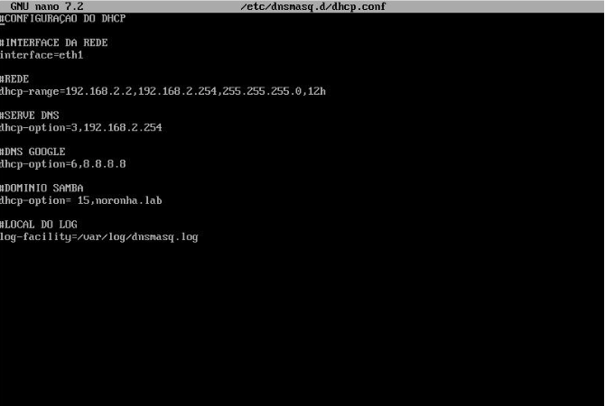
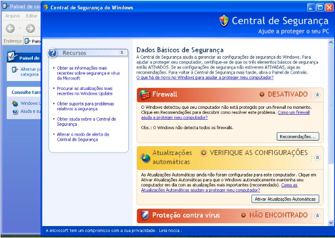
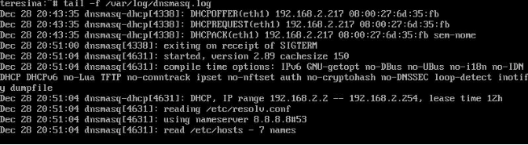
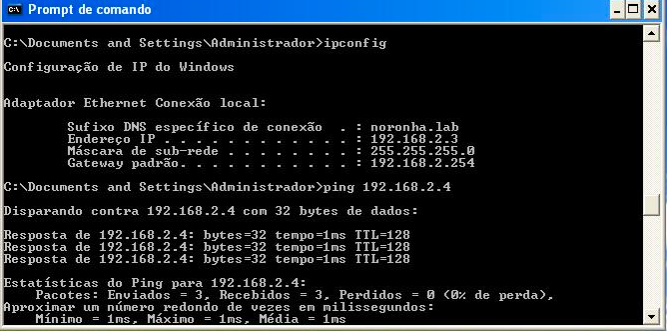

# DHCP
# AVALIAÇÃO
Incluir o(s) nome(s) e o conteúdo do(s) arquivo(s) de configuração.

- Distribuir um intervalo (*range* em inglês) de endereços IP; (15 pontos)
- Reservar 2 endereços (IP fixo) fora do intervalo do item anterior. (5 pontos)

## Instalação
#### Instalando o "DNSMASQ" na maquina "Xarope" para rodar na maquina.
```
Comando - sudo apt install DNSMASQ
```
#### Após a instalação do DNSMASQ, precisamos subir o serviço no linux.
Caso você esteja usando o ubuntu use:
```
comando - systemctl dnsmasq start
```

Caso você esteja usando o alpine ou semelhante use: 
```
comando - service dnsmasq start
```
#### <br> O terminal mostrará dnsmasq rodando no sistema.

#### Agora você precisará entrar no diretório /etc/dnsmasq.d e criar um arquivo de configuração do serviço.
```
comando - touch dhcp.conf
```
#### Dentro do arquivo dhcp.conf, coloque as configurações. Ela tem que ficar desse modo:

```
#CONFIGURAÇÃO DO DHCP

#INTERFACE DA REDE
. interface=eth1
. dhcp-range=192.168.2.2,192.168.2.254,255.255.255.0,12h
#SERVE DNS
. dhcp-option=3,192.168.2.254
#DNS GOOGLE
. dhcp-option=3,8.8.8.8
#DOMINIO SAMBA
. dhcp-option=15,noronha.lab
#LOCAL DO LOG
. log-facility=/var/log/dnsmasq.log

#IPS FIXO POR MAC
. dhcp-host=08:00:27:B5:E1:71,192.168.2.3
. dhcp-host=08:00:27:6D:35:FB,192.168.2.4
```


#### Configurando a maquina windows:
* No windows, clique no menu "iniciar" 
* Com esse comando você poderar acompanhar o log.
* Após isso, entre no "painel de controle"
* Dentro do "painel de controle" procure "Conexões de rede"
* Vai aparecer um simbolo com o nome "Conexão local"
* Clicando nela, Você entra em propriedades, e clica na opção de protocolo.
* Nisso voce troca a opção de ip fixo para dhcp


##### OBS: precisa delisgar o firewall para conseguir pingar

#### Fazendo o teste de ping com ip fixo:
Ping 192.168.2.3 <br>
Ping 192.168.2.4


## LOG 
#### ONDE ENCONTRAR O LOG DO DNSMASQ
```
comando - tail -f /var/log/dnsmasq.log
```


## Teste


