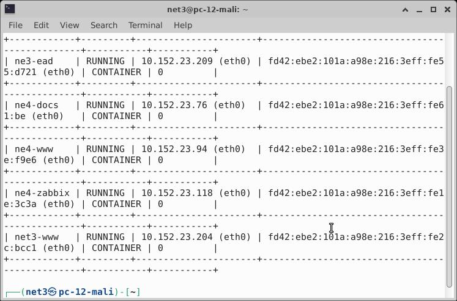
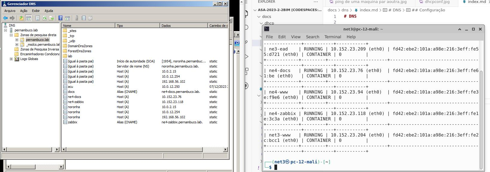
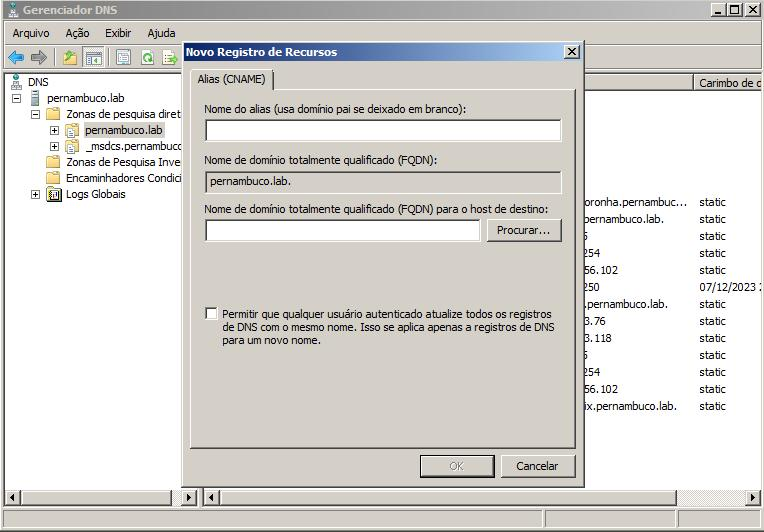
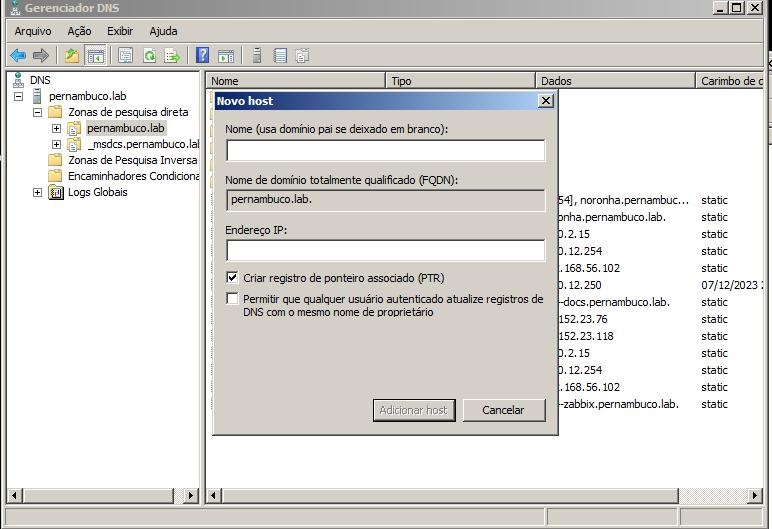

# DNS
```
Incluir o(s) nome(s) e o conteúdo do(s) arquivo(s) de configuração.

Cinco registros (4 pontos cada):

- 3 do tipo A (Endereços);
- 2 do tipo CNAME (`www` e `docs`);

```

## Instalação

#### Programas necessarios:
* samba
* lxc
```
comando de instalação
    sudo apk add lxd

    sudo apk add samba
```

## Configuração

Primeiro passo para realizar o serviço dns. você precisará criar a quantidade de containes necessarios para 
seu serviço.

#### comando para criar um container:
```
comando - lxc launch images:/versão/caminho/ nome-do-container

```


#### Seguindo o passo seguinte, devemos obter o ip do container:

```
comando - lxc list
```


#### Assim os containers aparecerão na sua tela, com os ips. Com os ips em mão, precisamos utilizar gerenciador dns do windows que você utilizou o serve samba(noronoha.lab) e criar os registros dentro das (ous) 



