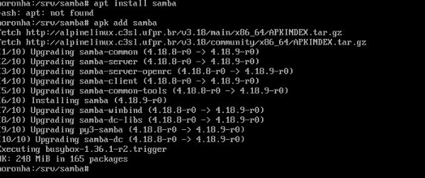
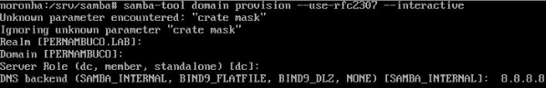
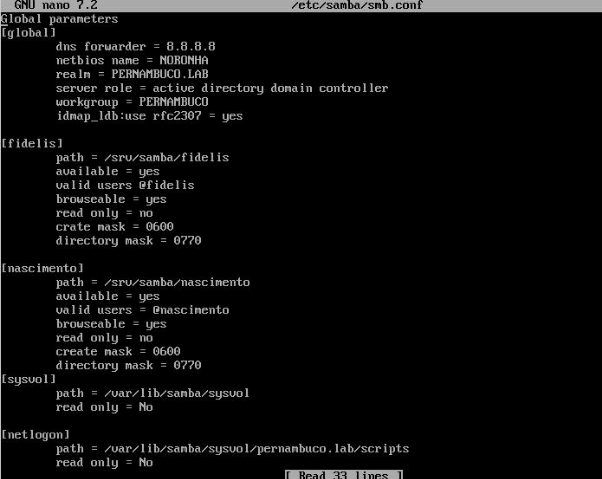
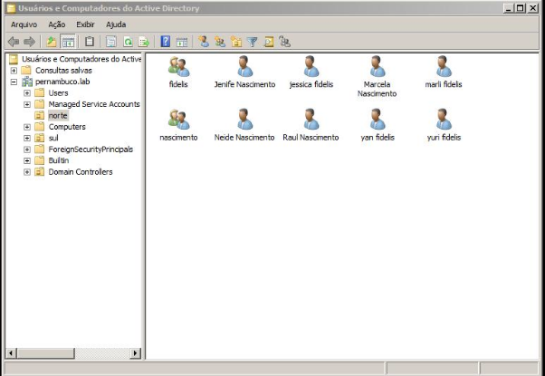
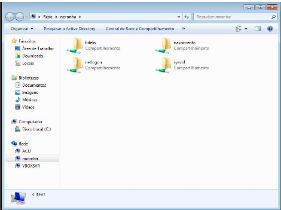

# SMB

## AVALIAÇÃO

Incluir o(s) nome(s) e o conteúdo do(s) arquivo(s) de configuração.

1. Criar 2 grupos para dois de seus sobrenomes;
2. Criar 4 usuários, dois para cada um dos sobrenomes;
3. Compartilhar duas pastas com dois de seus sobrenome, compartilhado para o grupo com o sobrenome correspondente.

## Instalação
### Primeiro passo foi instalar o samba na máquina xarope.
```
Comando - apk add samba
```

#### Colocando o comando no samba para levantar o domínio(noronha). Com esse comando podemos escolher o nome do domínio, dns (backend), realm.
```
Comando - samba-tool domain provision –use-rcf2307 –interactive
```

<H4> Continuando a construir a base do samba, nessa etapa, crio as pastas das familias que pretendo compartilhar.</H4> 

``` 
Pastas /srv/samba/(fidelis, nascimento)
```

#### Após criar as pastas das familias, nessa etapa, é preciso  entrar no arquivo(smb.conf), que se encontra na pasta (/etc/samba/), nele, eu configurei e acrescentei cada família no domínio noronha.
#### Você precisa fazer uma configuração no arquivo smb.conf
```
Caminho - /etc/samba/smb.conf
```

#### Dentro do smb.conf, configuramos o samba para encaminhar os grupos e seus diretorios.
  [GLOBAL]

* [FIDELIS] <br>
        path = /srv/samba/fidelis <br>
        available = yes <br>
        valid users @fidelis <br>
        browseable = yes <br>
        read only = no <br>
        create mask = 0600 <br>
        directory mask = 0770 <br>
* [NASCIMENTO] <br>
        path = /srv/samba/nascimento <br>
        available = yes <br>
        valid users = @nascimento <br>
        browseable = yes <br>
        read only = no  <br>
        crate mask = 0600 <br>
        directory mask = 0770 <br>

* Em seguida, iniciei a máquina windows com a conta (admin) e configurei a placa de rede local 1, que se encontrava em rede interna com a maquina real.

```
rede interna: intnet
```
#### Assim que configurei a placa com o ip da máquina linux. eu entrei na ferramenta Usuários e domputadores do AD, e criei duas OU (norte,sul) dentro da (OU-NORTE) coloquei as duas famílias pela interface grafica.

```
Programa - ActiveDirectory
```

```
Comando: Samba-tool ou list
```

##### Obs: Listei no linux, usando o comando samba-tool ou list, as unidades organizacionais.
##### OBS: para abrir as pastas no windows, você vai no "menu iniciar" e escreve o nome do seu dominio dessa forma:

```
comando - \\noronha
```
As proximas etapas é a ativação do compartilhamento de pastas da mesma rede.


Em seguida na máquina windows, no usuário(marli.fidelis) de uma das famílias, eu cliquei no botão iniciar, e digite o domínio(noronha).

## Teste

#### Para ver se funcinou, você deve entrar no usuario criado na conta admin do windows, e colocar o domínio no menu iniciar (\\noronha), assim aparecerá as pastas compartilhadas das familias, mas cada familia poderá somente utilizar a de seu respectivo grupo.


